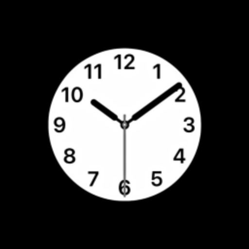

<div align="center">
  
  <h1>✨ Luxury Clock ✨</h1>
  <p><b>A Premium, Modern & Minimalist Desktop Clock Application for Windows</b></p>
  
  [](https://opensource.org/licenses/MIT)
  []()
  [](https://electronjs.org/)
</div>

<br>

<div align="center">
  <i>Elevate your desktop experience with a clock that combines elegance, precision, and modern design.</i>
</div>

---

## 🌟 Features

- **Sleek Interface:** A visually stunning, distraction-free minimalist design.
- **Always on Top:** Keeps the time visible whenever you need it (configurable).
- **Customizable:** Adjust aesthetics to match your personal style.
- **Lightweight:** Highly optimized, consuming minimal system resources.
- **Premium Animations:** Smooth transitions and a polished feel.

## 🚀 Download & Installation

The easiest way to get Luxury Clock is to download the compiled setup file:

1. Head over to the [Releases Page](https://github.com/kamranshakib/Luxury-Clock/releases).
2. Download the latest `Luxury-Clock-Setup.exe`.
3. Run the installer and enjoy!

---

## 💻 For Developers

Want to tweak the clock or build it yourself? It's easy!

### Prerequisites
- [Node.js](https://nodejs.org/) installed on your machine.
- Git.

### Setup & Run
Clone the repository and install dependencies:

```bash
git clone https://github.com/kamranshakib/Luxury-Clock.git
cd Luxury-Clock
npm install
```

Run the application in development mode:
```bash
npm start
```

### 🛠️ Building the Installer

To compile your own `.exe` installer, you can simply run the provided PowerShell script:
Right-click on `build.ps1` -> **Run with PowerShell**

Alternatively, you can run the build command directly in your terminal:
```bash
npm run build:win
```
*The output installer will be located in the `release/` directory.*

---

## 🤝 Contributing

Contributions, issues, and feature requests are welcome! Feel free to check the [issues page](https://github.com/kamranshakib/Luxury-Clock/issues).

## 📜 License

This project is [MIT](https://opensource.org/licenses/MIT) licensed.

<div align="center">
  <sub>Built with ❤️ by <a href="https://github.com/kamranshakib">Kamran Shakib</a></sub>
</div>
